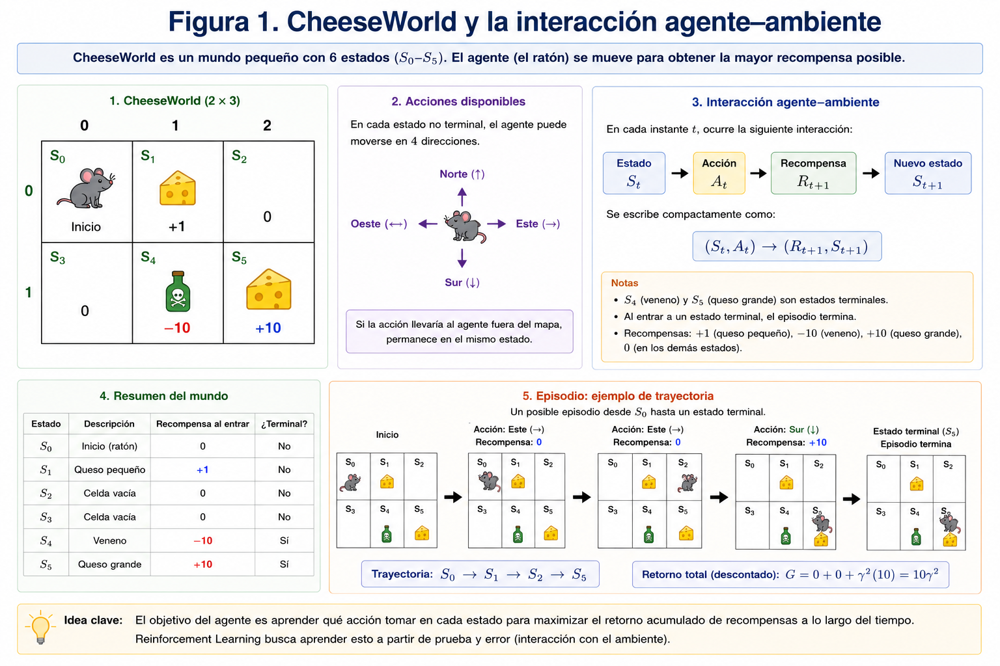
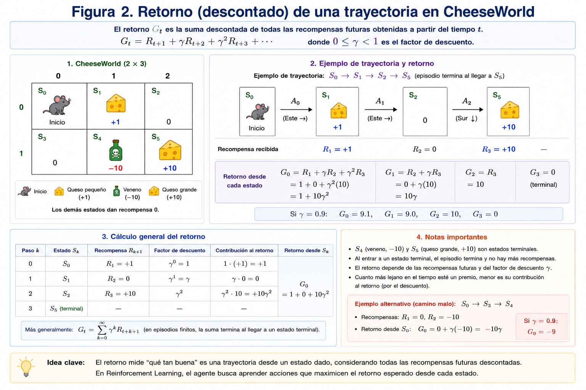
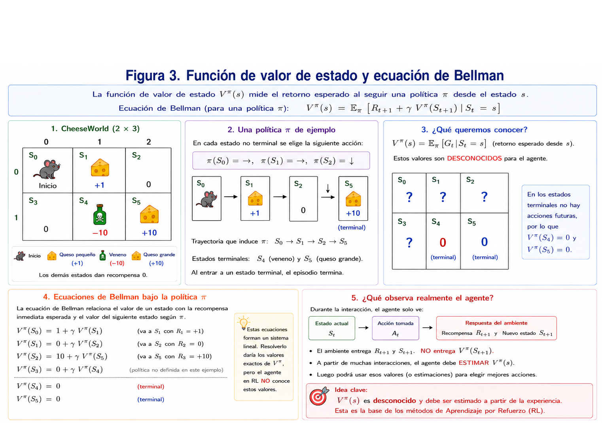
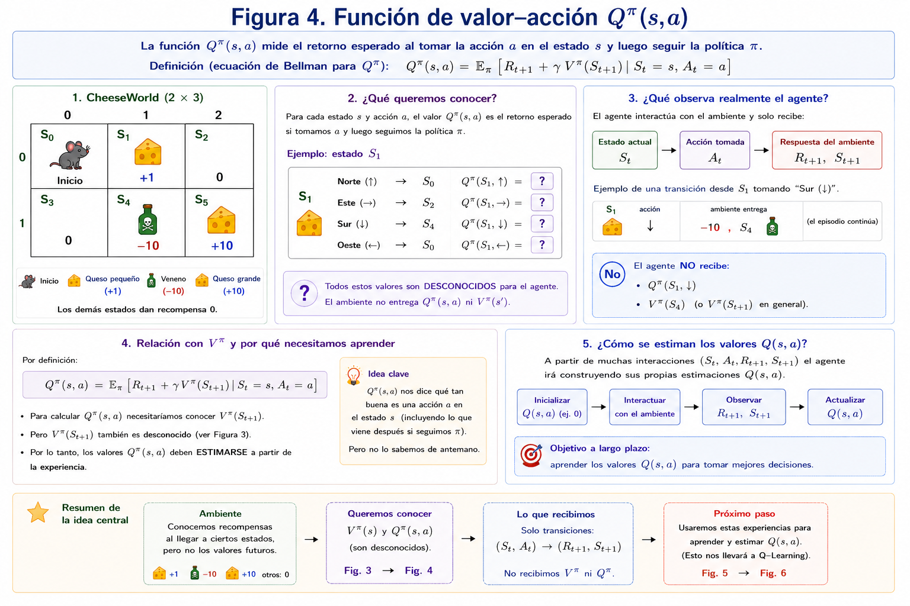
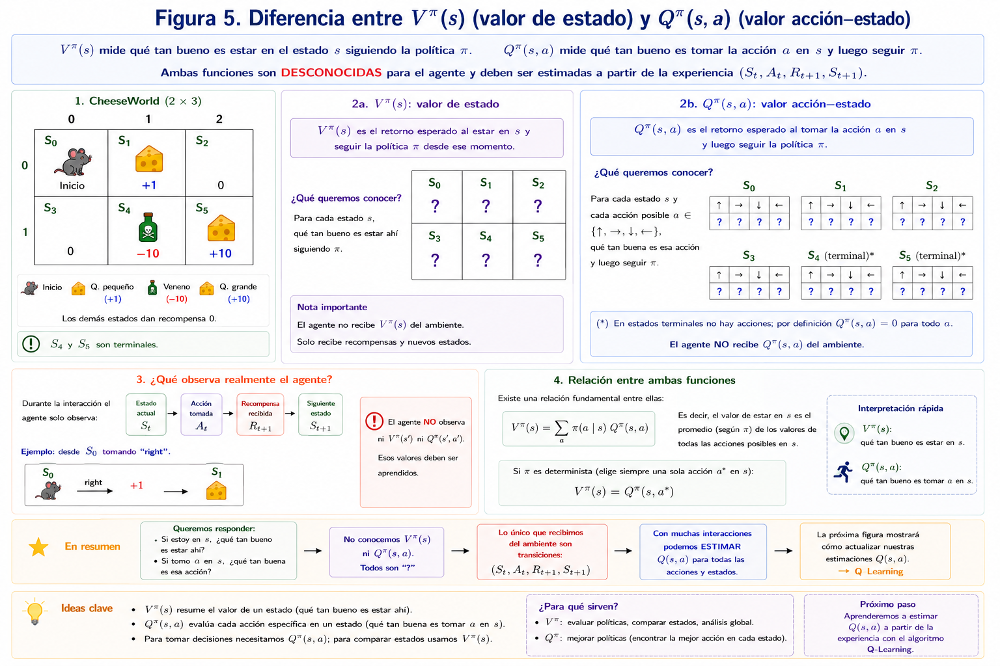
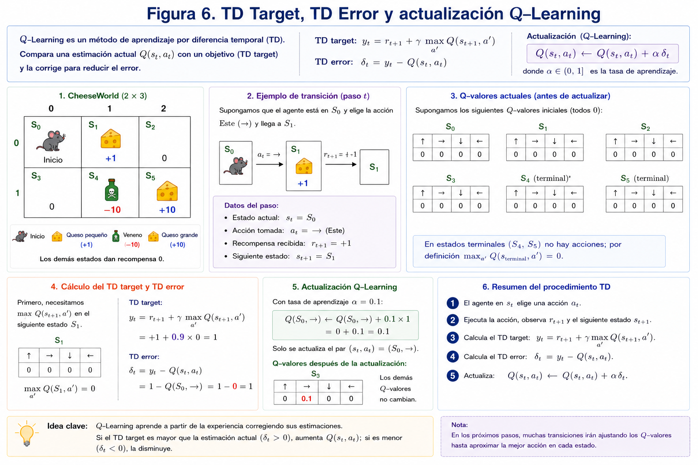
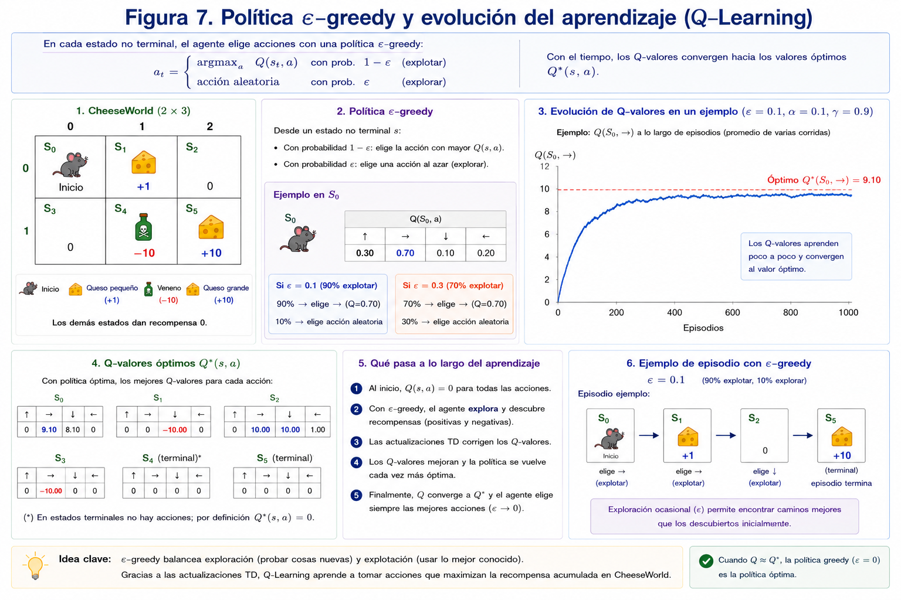
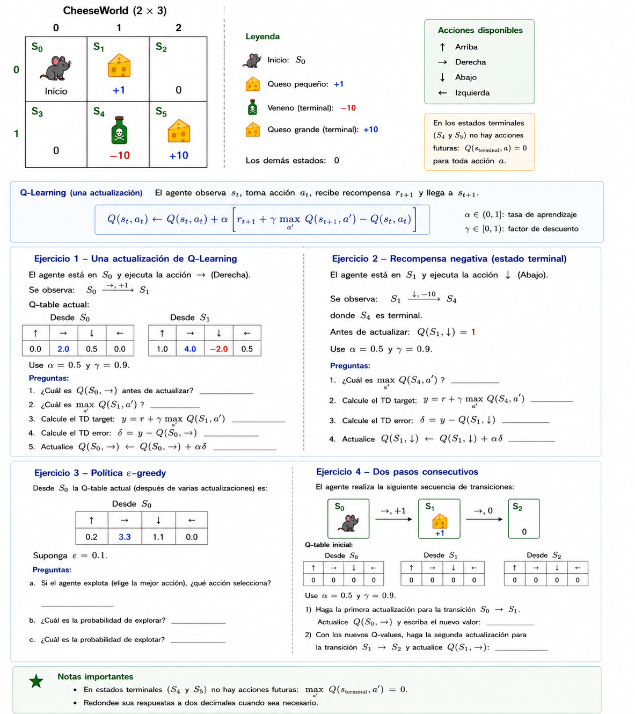

# Reinforcement Learning paso a paso con CheeseWorld

Este documento introduce los conceptos fundamentales de Reinforcement Learning usando un único ejemplo: **CheeseWorld**.

La idea es construir cada concepto a partir del anterior:

$$
\text{interacción}
\rightarrow
\text{retorno}
\rightarrow
V^\pi(s)
\rightarrow
Q^\pi(s,a)
\rightarrow
\text{Q-Learning}
$$

---

## 0. CheeseWorld y la interacción agente–ambiente

Usaremos el siguiente mundo:

- Estado inicial: $S_0$.
- Queso pequeño: recompensa $+1$.
- Veneno: recompensa $-10$ y termina el episodio.
- Queso grande: recompensa $+10$ y termina el episodio.
- Los demás estados tienen recompensa $0$.

Los estados corresponden a:

| Estado | Coordenada | Recompensa al entrar | Terminal |
|---|---:|---:|---|
| $S_0$ | $(0,0)$ | $0$ | No |
| $S_1$ | $(0,1)$ | $+1$ | No |
| $S_2$ | $(0,2)$ | $0$ | No |
| $S_3$ | $(1,0)$ | $0$ | No |
| $S_4$ | $(1,1)$ | $-10$ | Sí |
| $S_5$ | $(1,2)$ | $+10$ | Sí |

> **Figura 1. CheeseWorld y sus recompensas.**  


En Reinforcement Learning el agente interactúa con el ambiente de manera secuencial.

En el instante $t$:

1. el agente observa el estado $S_t$;
2. selecciona una acción $A_t$;
3. el ambiente ejecuta la acción;
4. el agente recibe una recompensa $R_{t+1}$;
5. el ambiente pasa al estado $S_{t+1}$.

$$
(S_t,A_t)
\longrightarrow
(R_{t+1},S_{t+1})
$$

Por ejemplo:

$$
(S_0,\text{right})
\longrightarrow
(+1,S_1)
$$

La recompensa corresponde a la transición realizada. En CheeseWorld esto equivale a la recompensa del estado al que llega el agente.

> **Figura 2. Ciclo de interacción agente–ambiente.**  


### Política

Una **política** $\pi$ especifica cómo selecciona acciones el agente.

En el caso determinístico:

$$
\pi(s)=a
$$

Por ejemplo:

$$
\pi(S_0)=\text{right}
$$

En una política estocástica:

$$
\pi(a|s)
$$

representa la probabilidad de ejecutar la acción $a$ estando en el estado $s$.

La política será importante porque tanto $V^\pi$ como $Q^\pi$ dependen de la forma en la que el agente se comportará en el futuro.

---

# 1. Recompensa y retorno de una trayectoria

Una recompensa individual solo indica qué ocurrió en **una transición**.

Supongamos la trayectoria:

$$
S_0 \xrightarrow{\text{right},\ +1}
S_1 \xrightarrow{\text{right},\ 0}
S_2 \xrightarrow{\text{down},\ +10}
S_5
$$

Las recompensas son:

$$
R_1=1,\qquad R_2=0,\qquad R_3=10
$$

Pero para evaluar toda la trayectoria necesitamos sumar las recompensas futuras.

A esta cantidad la llamamos **retorno**:

$$
G_t = R_{t+1}
+
\gamma R_{t+2}
+
\gamma^2R_{t+3}
+\cdots
$$

donde $\gamma$ es el **factor de descuento**:

$$
0\leq \gamma \leq 1
$$

Si usamos:

$$
\gamma=0.9
$$

entonces, desde $S_0$:

$$
G_0 =
1
+
0.9(0)
+
0.9^2(10)
$$

$$
G_0=9.1
$$

> **Figura 3. Retorno descontado de una trayectoria.**  


### ¿Por qué descontamos?

El factor $\gamma$ permite controlar cuánto valoramos las recompensas futuras.

Si:

$$
\gamma \approx 0
$$

el agente se preocupa principalmente por recompensas inmediatas.

Si:

$$
\gamma \approx 1
$$

las recompensas futuras tienen casi la misma importancia que las inmediatas.

---

# 2. Value Function

El retorno anterior corresponde a **una trayectoria específica**.

Ahora queremos responder una pregunta diferente:

> Si estoy en el estado $s$ y continúo siguiendo una política $\pi$, ¿cuánto retorno espero obtener?

La **función de valor** responde esta pregunta:

$$
V^\pi(s) =
\mathbb{E}_\pi[G_t\mid S_t=s]
$$

Es decir:

> $V^\pi(s)$ es el retorno esperado comenzando en $s$ y siguiendo la política $\pi$.

---

## Ejemplo en CheeseWorld

Supongamos que el agente sigue la política:

$$
\pi(S_0)=\text{right}, \qquad
\pi(S_1)=\text{right}, \qquad
\pi(S_2)=\text{down}
$$

Esta política produce la trayectoria determinística:

$$
S_0 \rightarrow S_1 \rightarrow S_2 \rightarrow S_5
$$

donde las recompensas observadas durante las transiciones son:

$$
S_0 \xrightarrow{+1} S_1
\xrightarrow{0} S_2
\xrightarrow{+10} S_5
$$

Como $S_5$ es terminal:

$$
V^\pi(S_5)=0
$$

La ecuación de Bellman relaciona el valor de cada estado con la
recompensa inmediata y el valor del siguiente estado:

$$
V^\pi(S_2)=10+\gamma V^\pi(S_5)
$$

$$
V^\pi(S_1)=0+\gamma V^\pi(S_2)
$$

$$
V^\pi(S_0)=1+\gamma V^\pi(S_1)
$$

Estas ecuaciones nos permiten ver qué valores tendría $V^\pi$
si conociéramos completamente la dinámica del ambiente.

> **Importante:** el agente no recibe estos valores del ambiente.
>
> Durante la interacción solo observa transiciones de la forma
>
> $$
> (S_t,A_t)\rightarrow(R_{t+1},S_{t+1})
> $$
>
> Los valores $V^\pi(s)$ son cantidades desconocidas que deben ser
> estimadas a partir de la experiencia.

Por tanto, la idea importante de Bellman no es que conozcamos el valor
del siguiente estado, sino que podemos relacionar una estimación con otra:

$$
\boxed{
\text{valor presente}
\approx
\text{recompensa observada}
+
\gamma\,\text{valor futuro estimado}
}
$$

Esta idea será la base para pasar de $V^\pi(s)$ a $Q^\pi(s,a)$ y,
finalmente, a Q-Learning.

Aquí aparece una idea fundamental:

> El valor de un estado depende de la recompensa inmediata **más el valor del siguiente estado**.

---

> **Figura 4. Bellman: valor presente = recompensa inmediata + valor futuro.**  

---

# 3. Q Function

La función $V^\pi(s)$ responde:

> ¿Qué tan bueno es estar en este estado?

Pero todavía no responde directamente:

> ¿Qué tan buena es una acción particular desde este estado?

Para eso usamos la **action-value function**:

$$
Q^\pi(s,a)
$$

definida como:

$$
Q^\pi(s,a) =
\mathbb{E}_\pi
[
G_t
\mid
S_t=s,\ A_t=a
]
$$

Interpretación:

> $Q^\pi(s,a)$ es el retorno esperado si estoy en $s$, ejecuto primero $a$ y después continúo siguiendo $\pi$.

---

## Ejemplo en CheeseWorld

Desde $S_0$ tenemos dos acciones posibles:

- `right`
- `down`

Si ejecutamos `right`, observamos:

$$
S_0
\xrightarrow[\text{right}]{+1}
S_1
$$

El ambiente nos entrega:

$$
R_{t+1}=+1,
\qquad
S_{t+1}=S_1
$$

Queremos conocer:

$$
Q^\pi(S_0,\text{right})
$$

que representa el retorno esperado al tomar `right` desde $S_0$
y luego continuar siguiendo la política $\pi$.

Por definición:

$$
Q^\pi(S_0,\text{right}) =
\mathbb{E}_\pi
\left[
G_t
\mid
S_t=S_0,\,
A_t=\text{right}
\right]
$$

También podemos relacionarlo con Bellman:

$$
Q^\pi(S_0,\text{right}) =
1+\gamma V^\pi(S_1)
$$

Pero aparece un problema:

$$
\boxed{V^\pi(S_1)\text{ es desconocido}}
$$

El ambiente no nos entrega $V^\pi(S_1)$.

---

Si ejecutamos `down`, observamos:

$$
S_0
\xrightarrow[\text{down}]{0}
S_3
$$

y queremos conocer:

$$
Q^\pi(S_0,\text{down})
$$

De nuevo:

$$
Q^\pi(S_0,\text{down}) =
0+\gamma V^\pi(S_3)
$$

pero:

$$
\boxed{V^\pi(S_3)\text{ también es desconocido}}
$$

Por tanto, aunque conceptualmente queremos comparar:

$$
Q^\pi(S_0,\text{right})
\quad\text{vs.}\quad
Q^\pi(S_0,\text{down})
$$

el agente **todavía no conoce ninguno de estos valores**.

La pregunta ahora es:

> ¿Cómo puede el agente aprender qué acción es mejor si solo observa
> recompensas y nuevos estados?

Eso nos lleva a estimar directamente los valores $Q(s,a)$ a partir
de la experiencia.

> **Figura 5. Comparación entre $V(s)$ y $Q(s,a)$.**  


---

## Relación entre $V$ y $Q$

Si conocemos $Q^\pi$, podemos obtener el valor de un estado bajo una política:

$$
V^\pi(s) =
\sum_a
\pi(a|s)Q^\pi(s,a)
$$

Si queremos actuar de manera greedy:

$$
\pi(s) =
\arg\max_a Q(s,a)
$$

Aquí aparece la razón práctica para aprender $Q$:

> Si conocemos $Q(s,a)$, podemos elegir una acción directamente.

---

# 4. Q-Learning

Hasta ahora hemos hablado de valores como si conociéramos el modelo del mundo.

Pero en Reinforcement Learning normalmente el agente **no conoce de antemano**:

$$
P(s'|s,a)
$$

ni necesariamente:

$$
R(s,a,s')
$$

El agente aprende interactuando con el ambiente.

En cada paso observa una experiencia:

$$
(s,a,r,s')
$$

y utiliza esa experiencia para mejorar su estimación de $Q(s,a)$.

---

## 4.1 Inicialización

Al comienzo podemos inicializar:

$$
Q(s,a)=0
$$

para todos los pares estado–acción válidos.

El agente todavía no sabe qué acciones son buenas.

---

## 4.2 TD target

Después de observar:

$$
(s,a,r,s')
$$

Q-Learning construye un objetivo:

$$
\text{TD target} =
r
+
\gamma
\max_{a'}Q(s',a')
$$

Este target combina:

- lo que ocurrió inmediatamente: $r$;
- la mejor estimación disponible del futuro.

---

## 4.3 TD error

Comparamos el target con nuestra estimación actual:

$$
\delta =
\text{TD target} - Q(s,a)
$$

o equivalentemente:

$$
\delta =
r + \gamma \max_{a'}Q(s',a') - Q(s,a)
$$

> **Figura 6. TD target y TD error en una transición.**  


---

## 4.4 Actualización de Q-Learning

Finalmente actualizamos:

$$
Q(s,a)
\leftarrow
Q(s,a)
+
\alpha\delta
$$

Sustituyendo $\delta$:

$$
Q(s,a) \leftarrow Q(s,a) + \alpha \left[r + \gamma \max_{a'}Q(s',a') - Q(s,a) \right] $$

donde $\alpha$ es el **learning rate**.

---

## Ejemplo numérico

Supongamos:

$$
Q(S_0,\text{right})=2
$$

El agente ejecuta `right` y observa:

$$
r=1
$$

Supongamos además que:

$$
\max_{a'}Q(S_1,a')=8
$$

con:

$$
\alpha=0.5,
\qquad
\gamma=0.9
$$

El TD target es:

$$
1+0.9(8)=8.2
$$

El TD error es:

$$
8.2-2=6.2
$$

Por tanto:

$$
Q(S_0,\text{right})
\leftarrow
2+0.5(6.2)
$$

$$
Q(S_0,\text{right})=5.1
$$

La experiencia hizo que el agente aumentara su estimación del valor de ejecutar `right` desde $S_0$.

---

## 4.5 Exploración y explotación

Si el agente siempre selecciona:

$$
\arg\max_aQ(s,a)
$$

desde el comienzo, puede dejar de descubrir acciones mejores.

Por eso durante el entrenamiento usamos una política **$\epsilon$-greedy**:

$$
A_t=
\begin{cases}
\text{acción aleatoria} & \text{con probabilidad }\epsilon\\
\arg\max_aQ(S_t,a) & \text{con probabilidad }1-\epsilon
\end{cases}
$$

Esto produce un balance entre:

- **exploración:** probar acciones;
- **explotación:** usar lo aprendido.

> **Figura 7. Exploración vs explotación con $\epsilon$-greedy.**  


---

## 4.6 Algoritmo completo

```text
Inicializar Q(s,a) = 0

Para cada episodio:

    observar estado inicial s

    mientras el episodio no termine:

        elegir a usando epsilon-greedy

        ejecutar a

        observar r y s'

        target = r + gamma * max Q(s',a')

        error = target - Q(s,a)

        Q(s,a) = Q(s,a) + alpha * error

        s = s'
```

Para un estado terminal:

$$
\max_{a'}Q(s',a')=0
$$

por lo que:

$$
\text{target}=r
$$

---

# 5. De CheeseWorld a problemas más grandes

En CheeseWorld podemos almacenar explícitamente una tabla:

$$
Q(s,a)
$$

porque tenemos pocos estados y pocas acciones.

Esta estrategia se conoce como **Q-Learning tabular**.

El siguiente paso será aplicar exactamente la misma idea en ambientes más grandes:

- FrozenLake;
- Taxi;
- Pac-Man pequeño.

En problemas como Pac-Man, el número de estados posibles puede crecer enormemente. Esto llevará posteriormente a una nueva pregunta:

> ¿Qué hacemos cuando ya no podemos almacenar un valor independiente para cada par $(s,a)$?

Esa pregunta conduce a **Approximate Q-Learning** y, más adelante, a métodos de Deep Reinforcement Learning.

---

# Resumen

La progresión conceptual es:

$$
\boxed{
\text{recompensas}
\rightarrow
G_t
\rightarrow
V^\pi(s)
\rightarrow
Q^\pi(s,a)
\rightarrow
\text{Q-Learning}
}
$$

- $R_{t+1}$: consecuencia inmediata de una transición.
- $G_t$: retorno acumulado desde un instante.
- $V^\pi(s)$: qué tan bueno es un estado bajo una política.
- $Q^\pi(s,a)$: qué tan buena es una acción desde un estado.
- Q-Learning: algoritmo que aprende una aproximación de $Q^*(s,a)$ mediante interacción.


---

# Ejercicio



