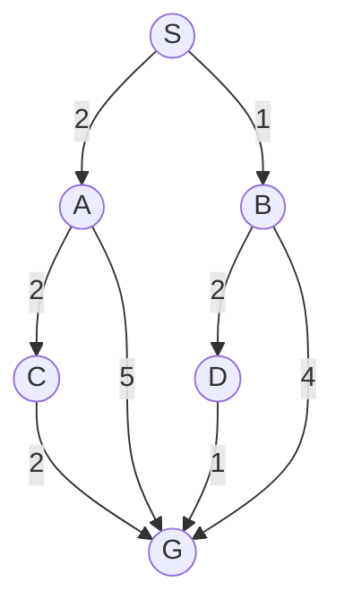

# Taller: búsqueda, optimización y Q-learning

**Modalidad:** trabajo individual, desarrollado a mano  
**Objetivo:** analizar una iteración de cada algoritmo y justificar las decisiones tomadas.

---

## 1. Algoritmos de búsqueda

Considere el siguiente problema. Los números sobre las conexiones representan su costo.

La expansión de sucesores se realiza de izquierda a derecha. El estado inicial es $S$ y el objetivo es $G$.

### Actividad

1. Después de expandir $S$, escriba el contenido de la frontera para:

   - BFS, FIFO, [A, B]
   - DFS, LIFO, [A, B]
   - UCS, G(N), [B(1), A(2)]

2. Para cada algoritmo, indique cuál es el siguiente nodo que se expande.
   - BFS, A
   - DFS, B
   - UCS, B

3. Realice las expansiones necesarias hasta que **UCS seleccione el objetivo**. En cada iteración complete:

| Iteración | Nodo seleccionado | Costo acumulado $g(n)$ | Frontera después de expandir |
|---:|---|---:|---|
| 1 | B:1 | 1 | A:2, D:3, G:5 |
| 2 | A:2 | 2 | D:3, G:5, C:4, G:7 |
| 3 | D:3 | 3 | G:5, C:4, G:7, G:4 |
| 4 | G:4 | 4 | G:6, G:7  |

4. Responda:

   a. ¿Por qué UCS selecciona primero $B$, aunque $A$ y $B$ estén en la misma profundidad?

   Porque cuesta menos irse por el camino de B (1) que A (2)

   b. ¿Cuál camino encuentra UCS?

   S-B-D-G

   c. ¿El primer camino que llega a $G$ necesariamente es el camino que UCS debe aceptar? Justifique.

   NO, el primer camino puede no ser el que menos cueste, aparte UCS no escoge el primer camino, primero vacia la frontera y coge la de menos costo

   d. Si todas las conexiones tuvieran costo $1$, ¿qué relación existiría entre BFS y UCS?
   Son iguales

---

## 2. Optimización: simulated annealing

Se quiere minimizar una función de costo. El algoritmo se encuentra actualmente en un estado con:

$$
f(s_{\text{actual}})=8
$$

Se genera un vecino con:

$$
f(s_{\text{nuevo}})=11
$$

La temperatura actual es:

$$
T=4
$$

Para problemas de minimización se utiliza:

$$
\Delta=f(s_{\text{nuevo}})-f(s_{\text{actual}})
$$

Si el vecino es peor, se acepta con probabilidad:

$$
P(\text{aceptar})=e^{-\Delta/T}
$$

Suponga que el algoritmo genera el número aleatorio:

$$
r=0.35
$$

### Actividad

1. Calcule $\Delta$.

11-8 = 3

2. ¿El nuevo estado es mejor o peor que el actual? Explique usando el signo de $\Delta$.
Peor, porque al ser posetivo significa que el nuevo costo es mayor al anterior

3. Calcule aproximadamente la probabilidad de aceptar el nuevo estado.
P = e ^ -3/4 = 0.4724

4. Compare la probabilidad calculada con $r$. ¿El algoritmo acepta el movimiento?

P>r, si se acepta

5. Sin realizar nuevamente todos los cálculos, explique qué ocurriría si:

   a. La temperatura fuera $T=0.5$.
   P = 0.002, la probabilidad de aceptar es mucho menor

   b. La temperatura fuera $T=20$.
   P= 0.86, La probabilidad de aceptar es mayor

6. Responda conceptualmente:

   a. ¿Por qué simulated annealing puede aceptar una solución peor?

   A veces aceptar soluciones peores permite salir de minimos locales

   b. ¿Qué ventaja tiene esta decisión frente a hill climbing?

   Explora mas y gracias a la temperatura, tiene una mayor capacidad para salir de minimos locales y llegar al global

   c. ¿Qué debería ocurrir con la exploración cuando la temperatura se aproxima a cero?

   El algoritmo se estabiliza y se vuelve como un hill climbing

   d. Si el vecino tuviera costo $5$, ¿sería necesario calcular una probabilidad para aceptarlo?
   No , ya que delta seria negativo, por lo que se acepta directamente

---

## 3. Q-learning

Un agente se encuentra en el estado $S$ y puede realizar tres acciones:

| Acción | Resultado inmediato | Recompensa | $Q(S,a)$ actual |
|---|---|---:|---:|
| Avanzar | Llega a $S'$ | $+1$ | $2.0$ |
| Esperar | Permanece en $S$ | $-1$ | $0.5$ |
| Saltar | Cae y muere | $-10$ | $-2.0$ |

En el siguiente estado $S'$, el mayor valor disponible es:

$$
\max_{a'}Q(S',a')=4
$$

Use:

$$
\alpha=0.5, \qquad \gamma=0.9
$$

La regla de actualización es:

$$
Q(S,a) \leftarrow Q(S,a)+
\alpha\left[
r+\gamma\max_{a'}Q(S',a')-Q(S,a)
\right]
$$

### Actividad

Suponga que el agente selecciona **Avanzar**.

1. Identifique:

   - $Q(S,\text{Avanzar})$ = 2
   - $r$ = 1
   - $\max_{a'}Q(S',a')$ = 4

2. Calcule el objetivo temporal:

$$
r+\gamma\max_{a'}Q(S',a')
$$
1 + 0.9(4) = 4.6

3. Calcule el error temporal:

$$
\delta = r+\gamma\max_{a'}Q(S',a')-Q(S,\text{Avanzar})
$$

4.6 - 2 = 2.6

4. Realice una actualización de $Q(S,\text{Avanzar})$.

= 2 + 0.5(2.6) = 3.3

5. ¿El valor de la acción aumentó o disminuyó? Explique por qué.

Aumento ya que el objetivo temporal era 4.6 y al  principio era solo 2, entonces el agente recibe la informacion que avanzar es valioso

### Preguntas de análisis

6. Si el agente aprende correctamente, ¿cómo debería ser el valor de **Saltar** en comparación con los valores de las otras acciones?

Ser mucho menor al de avanzar

7. Si morir termina inmediatamente el episodio, ¿se debe considerar el valor de un estado futuro en la actualización de **Saltar**? Explique.
No, ya que no exiaste un estado futuro

8. ¿Por qué el valor actual de $Q(S,\text{Saltar})=-2$ todavía podría ser demasiado alto?

No refleja la penalizacion de -10

9. Según la tabla actual, ¿qué acción seleccionaría una política completamente voraz?
Avanzar

10. ¿Significa lo anterior que el agente nunca puede seleccionar otra acción durante el entrenamiento? Explique considerando una política $\varepsilon$-greedy.

Con e-greedy, con probabilidad 1-e se selecciona la mejor accion y con probabilidad e, se selecciona una accion aleatoria. Permite equilibrar explotacion y exploracion

11. Suponga que **Avanzar** entrega recompensa inmediata $0$, pero conduce a estados con recompensas altas en el futuro. ¿Puede llegar a tener un valor $Q$ alto? Justifique.
Si, Q-learning no considera solamente la recompensa inmediata. También considera las recompensas futuras si Avanzar conduce a estados con valores \(Q\) altos, entonces puede terminar siendo alto.

12. ¿Qué controla cada parámetro?

| Parámetro | ¿Qué controla? | ¿Qué podría ocurrir si es muy alto? |
|---|---|---|
| $\alpha$ | Tasa de aprendizaje, cuanto cambia Q con cada experiencia | Los valores pueden cambair muy rapido causando que el aprendizaje sea inestable |
| $\gamma$ | Importancia de las recompensas futuras | Puede priorizar mucho el futuro frente a las recompensas inmediaras |
| $\varepsilon$ | Nivel de exploracion con e greedy | Se explora demasiado y se aprovecha menos lo aprendido |
